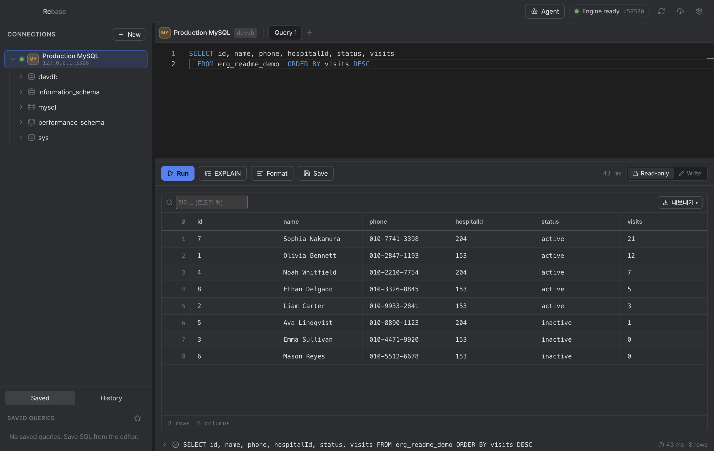

<div align="center">

# Rebase

**A fast, local-first desktop database manager for MySQL, PostgreSQL & Redis.**

Browse schemas, write SQL with autocomplete, and edit data inline — backed by a Go
query engine that streams results to a keyboard-friendly Electron UI.



</div>

---

## ✨ Features

**Connections**
- Create, edit, and delete connection profiles (MySQL · PostgreSQL · Redis)
- TLS modes; passwords stored in the OS keychain (never in plaintext)

**Schema explorer**
- Tables, views, indexes, and foreign keys
- Create / alter tables, manage indexes, view DDL — all from the context menu

**SQL editor**
- Monaco editor with schema-aware autocomplete and one-click formatting
- `EXPLAIN`, multi-statement scripts (one result tab each), and query history
- Streaming results with a row cap (opt-in "fetch all")

**Result grid**
- Sort, per-column filter chips, export (CSV / JSON)
- Full keyboard navigation, **pin/freeze columns**, copy selection
- One-click **"recent 500 rows"** from any table

**Editable data**
- Inline cell editing, add / delete rows, **transactional save** (all-or-nothing)
- **⌘/Ctrl+Enter to submit** pending edits (DataGrip-style)
- Execution status bar — last statement, time, and rows affected (click to expand)

**Redis**
- Keyspace explorer with pattern scan, live key count, and DB-index selection
- Value inspector for all types; **edit** string values, set/clear TTL, rename, and delete (with a confirm gate)
- **Command console** — run any Redis command with history, inline errors, and a guard on destructive commands

**More** — CSV import, foreign-key navigation, EXPLAIN plans, themed IntelliJ-style dark UI.

## ⌨️ Keyboard shortcuts

| Shortcut | Action |
| --- | --- |
| `⌘/Ctrl` + `Enter` | Run query (editor) · submit pending edits (table) |
| `⌘/Ctrl` + `Alt` + `L` | Format SQL |
| `Double-click` / `Enter` | Edit the focused cell |
| `Tab` · `↑ ↓ ← →` | Move between cells |
| `⌘/Ctrl` + `C` | Copy the selection |

## 🧱 Architecture

A pnpm monorepo with a clear split between the UI shell, the renderer, and the engine:

```
rebase/
├── apps/
│   ├── desktop/     Electron main + preload — spawns & supervises the engine
│   └── renderer/    React 19 + Vite UI (Monaco editor, grids)
├── engine/          Go local engine — Clean Architecture
│   └── internal/    domain · application · ports · adapters · transport/http
└── docs/            Architecture notes, ADRs, specs & plans
```

- **Electron 28** desktop shell; the renderer talks to the engine only through a
  preload IPC bridge.
- **Go 1.25** engine exposes a localhost HTTP API and streams query rows (NDJSON).
  DB drivers live behind a `SQLConnector` port — adding a database means adding an
  adapter, not touching the UI.
- Connection profiles persist in a local SQLite store; secrets go to the OS keychain.

> Layering, policies, and testing rules are documented in
> [`AGENTS.md`](AGENTS.md) and [`docs/`](docs/).

## 🚀 Getting started

**Prerequisites:** Node 20+ (via nvm), pnpm, Go 1.25+.

```bash
pnpm install
pnpm dev          # starts the Vite renderer + Electron (which spawns the Go engine)
```

## 🧪 Testing

```bash
pnpm --filter renderer test      # renderer unit tests (vitest)
cd engine && go test ./...       # engine unit + integration tests (integration needs local DBs)
pnpm --filter desktop test:e2e   # Playwright Electron E2E (auto-skips if no local MySQL)
```

Every feature is built test-first where there is pure logic, then verified by
actually driving the running app (Playwright / CDP) — see `AGENTS.md`.

## 📦 Building for production

```bash
pnpm build                                   # engine + renderer + desktop
cd apps/desktop \
  && CSC_IDENTITY_AUTO_DISCOVERY=false pnpm exec electron-builder --mac
# → apps/desktop/dist/installers/Rebase-<version>-arm64.dmg
```

The unsigned build runs locally (ad-hoc signed). To distribute to other Macs either:

- **Personal / internal:** recipients clear the quarantine flag once —
  `xattr -cr /Applications/Rebase.app` — or use *System Settings → Privacy &
  Security → Open Anyway*; or
- **Public:** sign with an Apple **Developer ID Application** certificate and
  notarize (`electron-builder` does this automatically once the cert is in the
  keychain and notarization credentials are set).

## 📚 Documentation

| Doc | What's inside |
| --- | --- |
| [`AGENTS.md`](AGENTS.md) | Working rules — TDD, Clean Architecture, live-verification |
| [`docs/architecture.md`](docs/architecture.md) | System architecture |
| [`docs/development-principles.md`](docs/development-principles.md) | Layer rules & conventions |
| [`docs/testing-strategy.md`](docs/testing-strategy.md) | Test layers (unit → E2E) |
| [`docs/security.md`](docs/security.md) | Secret handling & query policy |
| [`docs/mcp-server.md`](docs/mcp-server.md) | Expose your DB to external AI clients over MCP |
| [`docs/auto-update.md`](docs/auto-update.md) | Releases & in-app auto-update |
| [`docs/adr/`](docs/adr/) | Architecture decision records |

## 🤝 Contributing

Contributions are welcome! Please read [`CONTRIBUTING.md`](CONTRIBUTING.md) for
the dev setup, test commands, and our **Conventional Commits** requirement
(releases are generated from commit history). By participating you agree to the
[Code of Conduct](CODE_OF_CONDUCT.md). To report a vulnerability, see
[`SECURITY.md`](SECURITY.md).

## 📦 Releases

Versioning and installers are fully automated via [release-please]: merging the
auto-generated **Release PR** cuts the version, tag, GitHub Release, and the
macOS/Windows installers. See [`docs/auto-update.md`](docs/auto-update.md).

[release-please]: https://github.com/googleapis/release-please

## 📄 License

[MIT](LICENSE) © motionz-kr
